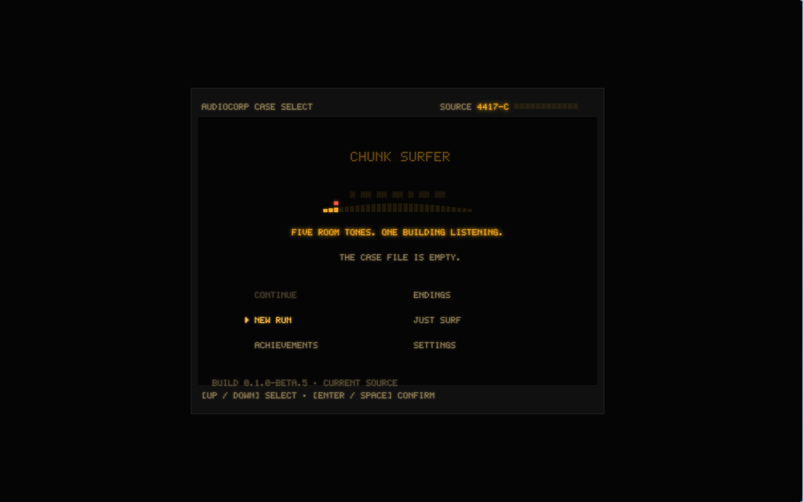
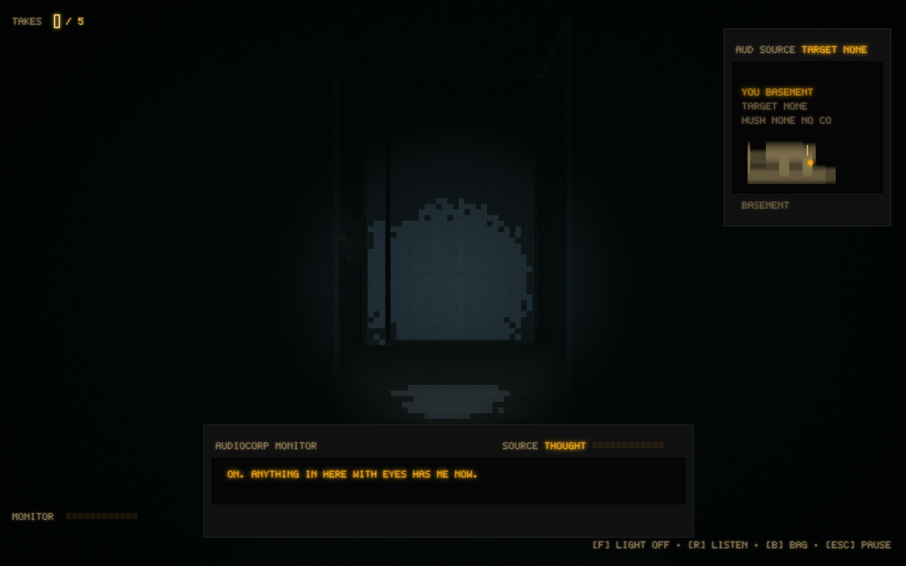
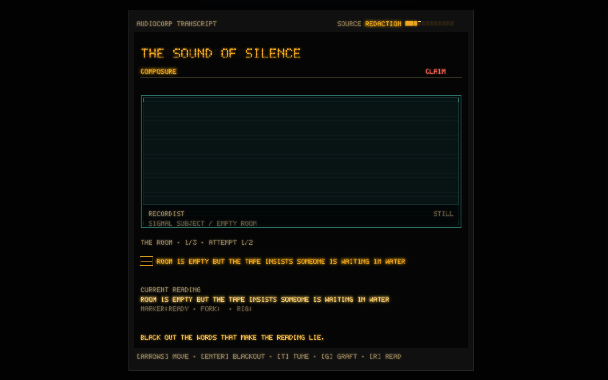

# Chunk Surfer

Chunk Surfer is a horror game about recording room tone inside Ellery
Conservatory: five rooms, one minute of clean silence each, and a building that
keeps listening back.



## Download the Latest Beta

Get the newest public beta from the [Chunk Surfer itch.io page](https://cbassuarez.itch.io/chunk-surfer).
Itch is the recommended download path because it presents normal platform
builds instead of split release-file parts.

| Platform | Architecture | Download |
| --- | --- | --- |
| macOS | Apple Silicon | itch channel `mac-arm64-beta` |
| Windows | x64 | itch channel `win-beta` |
| Linux | x64 | itch channels `linux-appimage-beta` and `linux-deb-beta` |

The beta downloads are intentionally large. Release builds include the offline
lens sidecar and pinned diffusion model resources up front, so the game should
not ask players to download model weights after first launch.

GitHub Releases remain available as a developer mirror at
[github.com/cbassuarez/chunk-surfer/releases/latest](https://github.com/cbassuarez/chunk-surfer/releases/latest).
Large GitHub assets may be split into `.part-*` files to stay under GitHub's
per-file release limit, so use itch unless you specifically need the mirror.

### Before You Install

- macOS builds currently target Apple Silicon.
- Windows and Linux builds target x64 machines with NVIDIA/CUDA-capable
  hardware for the bundled lens runtime.
- Desktop betas are unsigned while release testing is in progress, so your OS
  may show an unsigned-app warning.
- The microphone feature is optional. If enabled, the game only uses local
  loudness to decide whether a room is quiet enough; it does not record or
  upload audio.

## Feedback and Bug Reports

Use the repo issue tracker for beta feedback:

- [Report a bug](https://github.com/cbassuarez/chunk-surfer/issues/new?labels=bug)
- [Send playtest feedback](https://github.com/cbassuarez/chunk-surfer/issues/new?labels=feedback)
- [Browse open issues](https://github.com/cbassuarez/chunk-surfer/issues)

Useful reports include your OS, CPU/GPU, controller model if relevant, the beta
version, what you expected, what happened, and any diagnostic report exported
from the in-game About/Support panel.

## About the Game

You are sent into Ellery Conservatory to capture five clean room tones. Movement,
breath, equipment handling, and your own room can spoil the take. The work order
starts as a technical job and becomes a case file about sound, consent, and a
recordist who may still be in the building.

Core systems:

- First-person exploration through a hostile, audio-reactive conservatory.
- Room-tone recording where silence is a resource and a rule.
- Physical redaction battles built around blacking out words and defending a
  reading of the transcript.
- A field bag with map, documents, equipment, records, and return reports.
- Full keyboard/mouse and controller-oriented input paths for normal play.
- Optional local microphone loudness checks for the room-silence mechanic.

<table>
  <tr>
    <td width="50%">
      
    </td>
    <td width="50%">
      <strong>Field work.</strong><br>Move through the conservatory with the light on only when you can afford what it attracts. Room tone is recorded in the dark, but the building is easier to understand when you risk being seen.
    </td>
  </tr>
  <tr>
    <td width="50%">
      <video src="docs/media/chunk-surf-source-space.webm" controls muted loop playsinline width="100%"></video>
      <br><a href="docs/media/chunk-surf-source-space.webm">Watch the Chunk Surf clip</a>
    </td>
    <td width="50%">
      <strong>Chunk Surf.</strong><br>Some routes rupture into fullscreen source-code space: literal game files become floors, walls, portals, and redaction surfaces.
    </td>
  </tr>
  <tr>
    <td width="50%">
      
    </td>
    <td width="50%">
      <strong>Transcript fights.</strong><br>Redaction battles make the argument physical: choose what to black out, defend the reading, and live with what the tape says back.
    </td>
  </tr>
</table>

## For Developers

This repository is the standalone extraction from `cbassuarez.github.io` with a
Tauri v2 desktop shell for macOS, Windows, and Linux. The browser game remains
the canonical runtime, and the desktop shell packages that web build rather than
rewriting the game in another engine.

### Run the Latest Playable Desktop Build

```sh
npm install
npm run lens:setup       # one time; installs the local GPU lens runtime
npm run play:latest
```

`play:latest` and `tauri:dev` start the separately managed development lens and
the native Tauri app together. On a fresh cache the calibration screen generates
all six ten-tile material banks. The authored 22-second opening credits begin
only after calibration succeeds, and their clock pauses whenever the game is
hidden or unfocused so the opening cannot expire behind another app.

Development deliberately supplies the same service protocol from the local
Python environment so iteration can stay fast. Storefront and release builds do
not use that runtime-download path: they ship the pinned model resources inside
the app bundle so the download size honestly reflects the storage required to
play.

For browser-only work, run `npm run lens:local` in one terminal and `npm run
dev` in another, then open the Vite URL.

### Web Build

```sh
npm run build
npm run preview
```

The Vite build uses `base: './'` so generated assets are safe for static preview and Tauri packaging.

### Package the macOS Beta 6 Candidate

```sh
npm run beta:build:mac
```

This downloads the pinned model resources at build time, builds the Apple
Silicon sidecar, merges `src-tauri/tauri.lens.conf.json`, and creates the DMG under
`src-tauri/target/aarch64-apple-darwin/release/bundle/dmg/`. It is intentionally
large and can take a long time on its first run.

`npm run tauri:build` always merges the lens bundle config. If a packaged build
does not contain `src-tauri/lens-resources/lens/` and a `chunk-lens` sidecar, it
is not a release candidate.

The Beta 6 source version is `0.1.0-beta.6`; the release tag is
`v0.1.0-beta.6`. Before creating that tag, run:

```sh
npm test
npm run test:acoustic
npm run test:desktop
npm run tauri:check
npm run beta:preflight
```

`beta:preflight` intentionally requires a clean worktree. Pushing the tag starts
the release workflow, which builds the mandatory lens package independently on
macOS Apple Silicon, Windows x64/NVIDIA, and Linux x64/NVIDIA runners and
publishes a GitHub prerelease. Unsigned local bundles are expected at this
stage. Signing, notarization, and storefront automation are tracked in
`STORE_PREP.md`.

Windows release CI ships a portable zip instead of an installer. The offline
lens payload is large enough that both NSIS and WiX/MSI can fail on
GitHub-hosted Windows runners, so the beta release artifact keeps
`chunk-surfer.exe`, `chunk-lens.exe`, and the `lens/` resources together in one
folder. GitHub-hosted beta assets larger than 2 GiB are uploaded as split
`.part-*` files with checksum manifests.

### Stage and Publish itch Builds

Release builds should be staged to itch before treating GitHub Releases as
public-facing. Butler reads credentials from the environment; never commit API
keys.

```sh
export BUTLER_API_KEY='your itch Butler API key'
export ITCH_TARGET='cbassuarez/chunk-surfer'
npm run itch:stage
npm run itch:preview
export ITCH_CONFIRM_PUSH=1
npm run itch:push
```

`itch:preview` runs Butler previews for `win-beta`, `mac-arm64-beta`,
`linux-appimage-beta`, and `linux-deb-beta`. `itch:push` publishes the same
channels with `--userversion` taken from `package.json`.

For a full public beta, let GitHub Actions publish itch. The release workflow
builds all platform artifacts, stages them to Butler, runs a preview, pushes
the four itch channels, and only then updates the GitHub developer mirror. The
workflow requires repository secret `BUTLER_API_KEY` and repository variable
`ITCH_TARGET`.

Local `itch:*` commands are mainly for checking already-downloaded artifacts.
If your machine only has one platform build, publish just that channel with
`ITCH_CHANNELS=mac-arm64-beta npm run itch:preview`; otherwise download the CI
artifacts into `release-assets/` first.

### Tests

```sh
npm test
npm run test:acoustic
```

Browser smoke tests under `tools/chunk_surfer/tests/` expect a running Vite dev server and a local Chrome/Chromium compatible with `puppeteer-core`.

### Migration Note

Extracted from `/Users/seb/cbassuarez.github.io` after source snapshot commit:

```txt
d75d9f189883ca4eb48008bb164d2c190afdc3f8
```

History is partially preserved via a filtered clone containing the game, its toolchain, and required audio sample pools. The original repo remains untouched after the snapshot commit except for its pre-existing untracked ZIP snapshots.

## Native Desktop Storage

The game still renders as a web app, but persistence now goes through `src/platform/storage/`.

### Browser mode

Browser mode uses `localStorage` through `BrowserStorage`:

- `chunk-surfer:settings:v1`
- `chunk-surfer:profile:v1`
- `chunk-surfer:save:autosave:v1`

It also reads legacy keys such as `chunk-surfer:save:v3` and `chunk-surfer:meta:v2` once and leaves them in place for compatibility.

### Desktop mode

Tauri mode uses explicit JSON files in app directories:

- AppConfig: `settings.json`
- AppData: `profile.json` and `saves/*.json`
- AppData: `saves/backup/*.previous.json` for recovery
- AppData: `migration/localstorage-import-v1.json`
- AppLog: `chunksurfer.log` / Tauri log target

### Recovery

JSON files use versioned envelopes. Saves are written through a temp-file + readback path and the previous primary file is copied to `saves/backup/` before replacement. If a primary save is corrupt, the app attempts to load and restore the previous backup. Unknown newer schema versions are not overwritten in that session.

### Support

The diagnostics service can export app version, schema versions, platform mode, renderer/lens query settings, storage layout, migration status, and recent storage/log errors. Desktop builds can reveal save/log folders through Tauri opener APIs.

### Steam Cloud

Cloud-sync `profile.json` and `saves/*.json` only. Do not sync `settings.json`, input/window state, migration logs, diagnostics logs, renderer caches, or temp files. See `docs/storage-and-cloud.md`.

## Troubleshooting

### Blank screen / missing assets

Run `npm run build` and verify that `dist/assets`, `dist/audio`, and `dist/index.html` exist. Runtime asset paths are relative to the app base, not `/labs/chunk-surfer/`.

### Linux WebKit dependencies

Tauri Linux builds require WebKitGTK and related system packages. The release workflow installs `libwebkit2gtk-4.1-dev`, `libappindicator3-dev`, `librsvg2-dev`, `patchelf`, and `xdg-utils`.

### macOS unsigned app warning

Local builds are unsigned. macOS may warn when opening the app. Developer ID signing and notarization are not configured yet.

### Audio unlock behavior

The game uses Web Audio. If a WebView applies autoplay restrictions, the first explicit menu/title input should unlock the audio context. Do not rely on hover or cursor movement to start title/menu hiss.

## Creating the GitHub remote

Do not run this until you have decided private vs public and are ready to push.

```sh
cd /Users/seb/chunk-surfer
gh repo create cbassuarez/chunk-surfer --private --source=. --remote=origin --push
```

If you choose public later, replace `--private` with `--public`.
